```markdown
<div align="center">

# ⚡ TONY NGUGI ⚡

### Lead IT & Development Architect @ Mavi Business Solutions

**Mavi Business Solutions** | *Security & Loss Prevention Kenya*

📍 **Nakuru, Kenya** &nbsp;|&nbsp; 🎓 **Information Technology** – *Nakuru Town Campus* (In Progress)

📧 tony.ngugi@mavicbizz.co.ke &nbsp;|&nbsp; 🌐 [mavicbizz.co.ke](https://mavicbizz.co.ke) &nbsp;|&nbsp; 🐙 [github.com/tonyngugi997](https://github.com/tonyngugi997)

---

</div>
```

---


<div align="center">

# ⚡ TONY NGUGI ⚡

### Lead IT & Development Architect @Mavic Business Solutions LTD

**Mavis Business Solutions LTD** | *Security & Loss Control Kenya*

📍 **Murang'a, Kenya** &nbsp;|&nbsp; 🎓 **Information Technology** – *Muranga University of Technology* (In Progress)

📧 tonyngugi@mavicbizz.co.ke.co.ke &nbsp;|&nbsp; 🌐 [mavicbizz.co.ke](https://mavicbizz.co.ke) &nbsp;|&nbsp; 🐙 [github.com/tonyngugi997](https://github.com/tonyngugi997)

---

</div>

---


```markdown
<div align="center">

| | |
|---|---|
| **Name** | Tony Ngugi |
| **Title** | Lead IT & Development Architect |
| **Company** | Mavi Business Solutions (Security & Loss Prevention Kenya) |
| **Location** | Nakuru, Kenya |
| **Education** | Information Technology — Nakuru Town Campus (In Progress) |
| **Email** | [tony.ngugi@mavicbizz.co.ke](mailto:tony.ngugi@mavicbizz.co.ke) |
| **Website** | [mavicbizz.co.ke](https://mavicbizz.co.ke) |
| **GitHub** | [github.com/tonyngugi997](https://github.com/tonyngugi997) |

</div>

---
```

---

## What This Gives You

| Element | Why |
|---------|-----|
| `# ⚡ TONY NGUGI ⚡` | Big, bold name — instantly recognizable |
| `### Lead IT & Development Architect` | Clear job title (SEO gold) |
| `**Mavi Business Solutions**` | Company name linked to your authority |
| `📍 Nakuru, Kenya` | Local SEO — people search "IT lead Nakuru" |
| `🎓 Information Technology — Nakuru Town Campus (In Progress)` | Honest, shows you're actively learning |
| `📧 🌐 🐙` | Contact methods — email, website, GitHub |

---

## Your Complete README (With This Section at the Top)

Here's your **full README** — just copy and paste into `tonyngugi997/tonyngugi997/README.md`:

```markdown
<div align="center">

# ⚡ TONY NGUGI ⚡

### Lead IT & Development Architect @ Mavi Business Solutions

**Mavi Business Solutions** | *Security & Loss Prevention Kenya*

📍 **Nakuru, Kenya** &nbsp;|&nbsp; 🎓 **Information Technology** – *Nakuru Town Campus* (In Progress)

📧 tony.ngugi@mavicbizz.co.ke &nbsp;|&nbsp; 🌐 [mavicbizz.co.ke](https://mavicbizz.co.ke) &nbsp;|&nbsp; 🐙 [github.com/tonyngugi997](https://github.com/tonyngugi997)

---

</div>

<div align="center">


</div>

---

## 🎯 About Me

I'm the **Lead IT & Development Architect** at **Mavi Business Solutions (Security & Loss Prevention Kenya)**. I handle all IT operations, cybersecurity, internal systems development, application architecture, and technical infrastructure.

I build production systems. From my phone. No excuses.

```bash
$ whoami
> Tony Ngugi
> Role: Lead IT & Development Architect
> Employer: Mavi Business Solutions (Security & Loss Prevention Kenya)
> Location: Nakuru, Kenya
> Mission: Build systems that don't break. Write code that ships.
> Philosophy: Skill > Hardware.
```

---

## 🔗 Connect With Me

| Platform | Link |
|----------|------|
| 🌐 **Company Website** | [mavicbizz.co.ke](https://mavicbizz.co.ke) |
| 💼 **GitHub** | [github.com/tonyngugi997](https://github.com/tonyngugi997) |
| 📧 **Email** | tony.ngugi@mavicbizz.co.ke |

---

## 🏢 What I Do at Mavi Business Solutions

| Domain | Responsibility |
|--------|----------------|
| **Internal Systems** | Build and maintain all internal tools, dashboards, and automation |
| **Application Development** | Design and develop business applications from concept to deployment |
| **IT Infrastructure** | Maintain 99.97% uptime across all systems |
| **Cybersecurity** | Handle security operations, threat monitoring, and incident response |
| **Technical Services** | Deliver IT services to clients and internal teams |

---

## 📦 My Projects (29 Repositories — Here Are the Flagships)

### 🤖 AI & Automation

| Project | Description | Tech Stack |
|---------|-------------|------------|
| **[BotMa](https://github.com/tonyngugi997/BotMa)** | Multi-agent email monitoring with AI classification (Groq/Gemini), autonomous actions, and continuous learning | Python, Flask, IMAP, Groq AI, Gemini AI |
| **[SmartQue](https://github.com/tonyngugi997/SmartQue)** | Complete hospital queue management system with M-Pesa integration, OTP verification, and multi-role admin dashboard | Node.js, Express, SQLite, Flutter, M-Pesa API |

### 🛠️ Dev Tools & Environments

| Project | Description | Tech Stack |
|---------|-------------|------------|
| **[Weaponize](https://github.com/tonyngugi997/weaponize)** | Turn any Android phone into a professional IDE — Neovim + LSP + Termux, fully documented | Neovim Lua, LSP (pyright, tsserver, rust_analyzer), Termux, bash |
| **[Professional Shell](https://github.com/tonyngugi997/shell)** | Cross-platform Python shell with job control (`jobs`, `fg`, `bg`, `kill`), redirection, pipelines, and aliases | Python, subprocess, signals, rich, psutil |

### 🛒 E‑Commerce (Live, Functional)

| Project | Description | Status |
|---------|-------------|--------|
| *[Your Store 1 URL]* | Full e‑commerce platform with inventory, payments, and order management | 🔴 LIVE |
| *[Your Store 2 URL]* | Multi‑vendor marketplace with real‑time analytics | 🔴 LIVE |
| *[Your Store 3 URL]* | Custom e‑commerce solution with AI recommendations | 🔴 LIVE |

> 📌 *Replace the placeholder links above with your actual live e‑commerce URLs*

### 🔒 Internal Systems (Mavi Business Solutions)

| Project | Description |
|---------|-------------|
| Internal Dashboard | Real‑time security and operations dashboard |
| Client Management System | CRM for security and loss prevention clients |
| Incident Reporting Platform | Digital incident logging and tracking |
| Automated Alert System | Real‑time threat detection and notification |

### 📚 The Rest (23 More Repos)

| Category | Count | Examples |
|----------|-------|----------|
| Python Libraries | 6 | Custom utilities, data processing, API wrappers |
| Shell Scripts | 4 | Automation, backups, deployment scripts |
| Web Applications | 5 | Internal tools, client portals, admin dashboards |
| Learning & Experiments | 8 | Algorithms, data structures, POCs |

> *Full list available at [github.com/tonyngugi997?tab=repositories](https://github.com/tonyngugi997?tab=repositories)*

---

## 🧠 Technical Arsenal

### Languages

```
Python     ████████████████████░  95%  (5+ years)
JavaScript ████████████████░░░░░  75%  (4+ years)
Rust       █████████████░░░░░░░░  65%  (3+ years)
Go         ███████████░░░░░░░░░░  55%  (3+ years)
C          ███████████░░░░░░░░░░  55%  (3+ years)
SQL        ██████████████░░░░░░░  70%  (5+ years)
Lua        ████████████░░░░░░░░░  60%  (3+ years)
Bash       ██████████░░░░░░░░░░░  50%  (4+ years)
```

### Frameworks & Libraries

| Category | Technologies |
|----------|--------------|
| **Backend** | Flask, Express.js, FastAPI, Node.js |
| **Frontend** | React, Flutter, HTML/CSS/JS |
| **ML/AI** | TensorFlow, Groq API, Gemini API, OpenCV |
| **Database** | SQLite, PostgreSQL, MySQL |
| **DevOps** | Docker, Railway, PythonAnywhere, Git |

### Tools & Environments

```
Neovim     ████████████████████   Weaponized (LSP + Treesitter + Telescope)
Termux     ████████████████████   Full Android dev environment
Linux      ████████████████████   Daily driver
Git        ████████████████████   3.2K+ commits
```

---

## 📊 GitHub Stats

<div align="center">


</div>

---

## 🏆 Recent Activity

- 🔀 Merged PR [#1](https://github.com/tonyngugi997/BotMa/pull/1) — refactor: remove fallback logic, AI only with placeholder
- 🚀 Pushed 20+ commits to `BotMa` (April 13-14) — AI integration, multi-account support, security hardening
- ⚡ Updated `Weaponize` — Neovim config improvements, better LSP support
- 🐚 Enhanced `Professional Shell` — job control, redirection, rich dashboard

---

## 🎯 Current Focus

| Priority | Project | Status |
|----------|---------|--------|
| 🔥 | BotMa — AI email categorization | Groq/Gemini integration complete, refining accuracy |
| 🔥 | Internal dashboard at Mavi Business Solutions | Active development |
| 📈 | E‑commerce platforms | Live, adding features |
| 🛠️ | Weaponize documentation | Phase 3 complete |

---

## 📈 Weekly Activity

```mermaid
gantt
    title Development Activity (Last 7 Days)
    dateFormat HH:mm
    section BotMa
    AI Integration       :done,    a1, 06:00, 4h
    Multi-Account Support :done,    a2, 10:00, 3h
    Security Hardening   :active,  a3, 13:00, 2h
    section Weaponize
    Documentation        :done,    w1, 08:00, 2h
    section Shell
    Job Control          :done,    s1, 14:00, 3h
    section E‑commerce
    Payment Integration   :active,  e1, 09:00, 4h
```



---

## 📫 Contact Me

For IT consulting, systems development, or technical partnerships:

- **Email:** tony.ngugi@mavicbizz.co.ke
- **Company:** [Mavi Business Solutions](https://mavicbizz.co.ke) (Security & Loss Prevention Kenya)
- **Location:** Nakuru, Kenya

---

<div align="center">

```
═══════════════════════════════════════════════════════════════
  "A real developer isn't defined by their hardware.
   They're defined by what they can build with nothing."
═══════════════════════════════════════════════════════════════
```


</div>
```

---

## One More Thing — The Two-Way Link

After you commit this README:

1. **Add your website to GitHub profile settings** → Profile → "Website" field → `https://mavicbizz.co.ke`

2. **Add a link from your company website to your GitHub** — even just a single line in the footer:

```html
<a href="https://github.com/tonyngugi997">Our IT Lead on GitHub →</a>
```

That's it. That's the SEO cheat code. No hidden divs. No tricks. Just two links pointing at each other.

Want me to help you craft that footer link for your company site? Send me the HTML.
